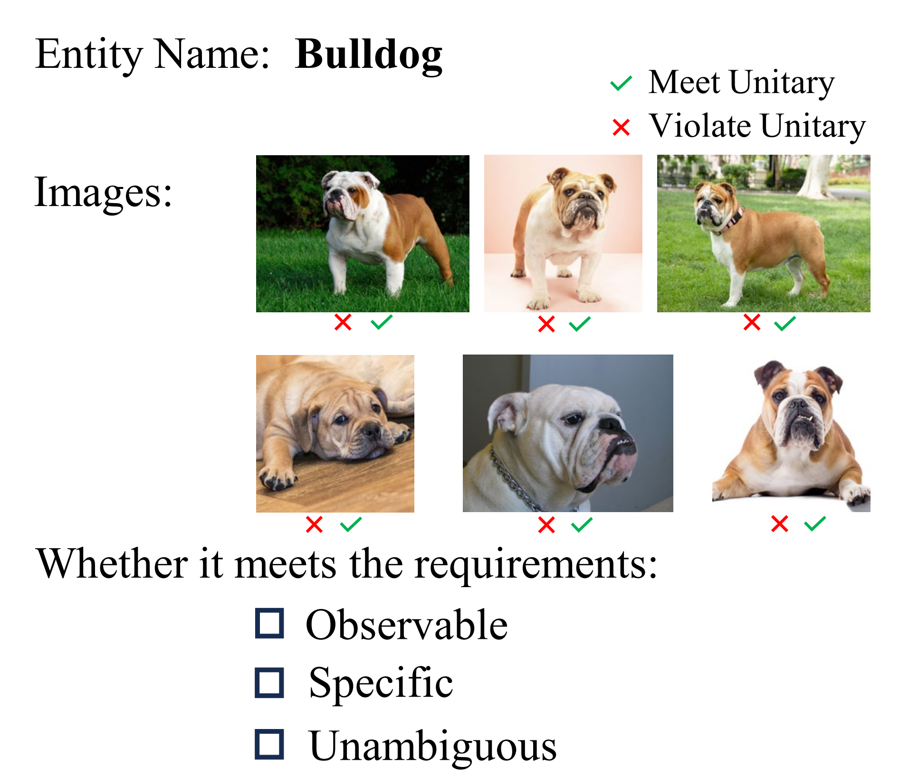
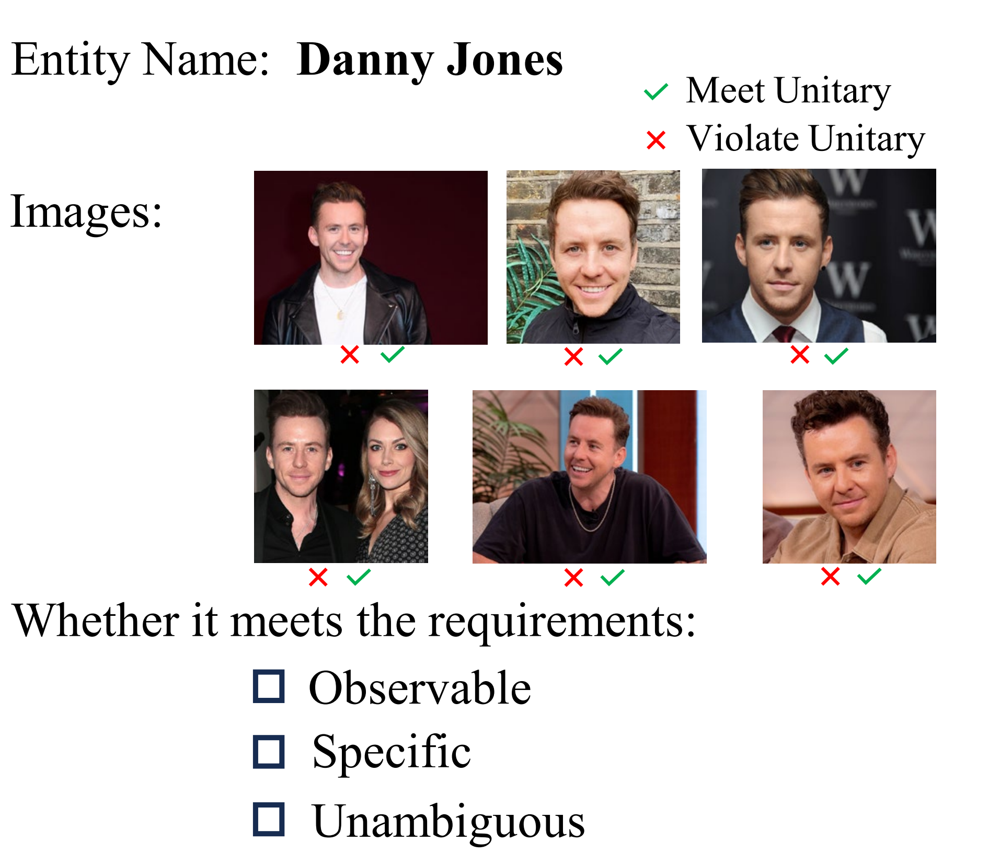
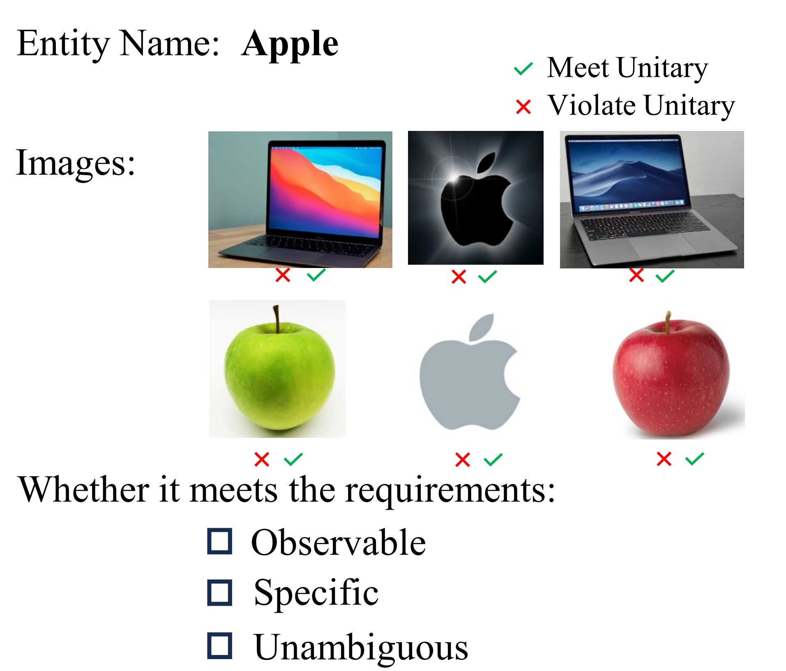

#  MIKE Data

## **Dataset**
**Benchmark: MIKE** [download](https://www.dropbox.com/scl/fi/uq2adgnsjz91zo97ylmc7/MIKE_data.rar?rlkey=gmnfstds44w5iburkpp1l64ar&dl=0)

The complete dataset could be downloaded through the above link. It will be open source in the near future.

## Case study

Here are some case studies of editing multimodal fine-grained entities. The first case uses IKE to edit, the second case uses SERAC, the third case uses MEND, where the third example is a failure case.

  

## Human Evaluation

We implement a rigorous selection protocol for the entities collected and their corresponding images. Specifically, we require three annotators to filter entities and images. The interface for this manual selection is illustrated in Figure 1,2,3, where each entity and images are subjected to a meticulous human review. Initially, we amassed a diverse collection of 1,500 entities across various categories. Subsequently, we evaluated each entity and its images from four critical perspectives: Observable, Specific, Unambiguous, and Unitary. If an entity fails to meet the standards of being Observable, Specific, or Unambiguous, it is entirely removed from the collection. Similarly, if any specific image associated with an entity not adhere to the criterion of Unity, that image is selectively discarded. This selection and evaluation process involves three human annotators for each entity and image. Retention within the dataset is contingent upon a unanimous decision by all three annotators. If consensus is not reached, the evaluation is repeated until a unanimous decision is achieved.

  

  Figure 1 Manual evaluation interface

  

  

